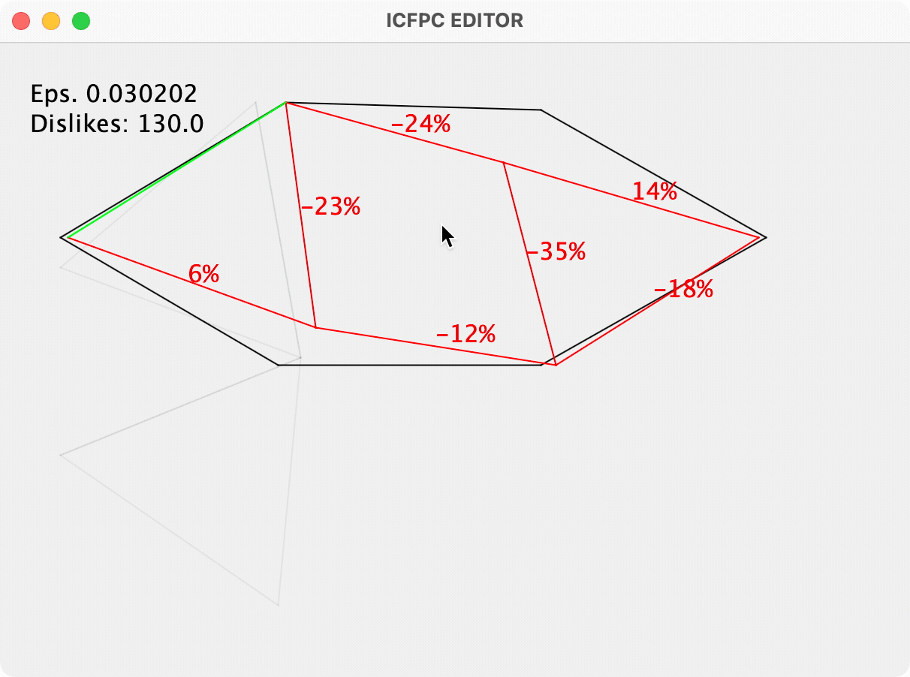

# ICFPC2021

I was trying to learn Clojure here (and maybe get a few points for manually solving ICFPC2021)

Inspired by watching https://twitter.com/nikitonsky

Running

```
$ API_TOKEN=xxxxxxxx-xxxx-xxxx-xxxx-xxxxxxxxxxxx lein run
```

